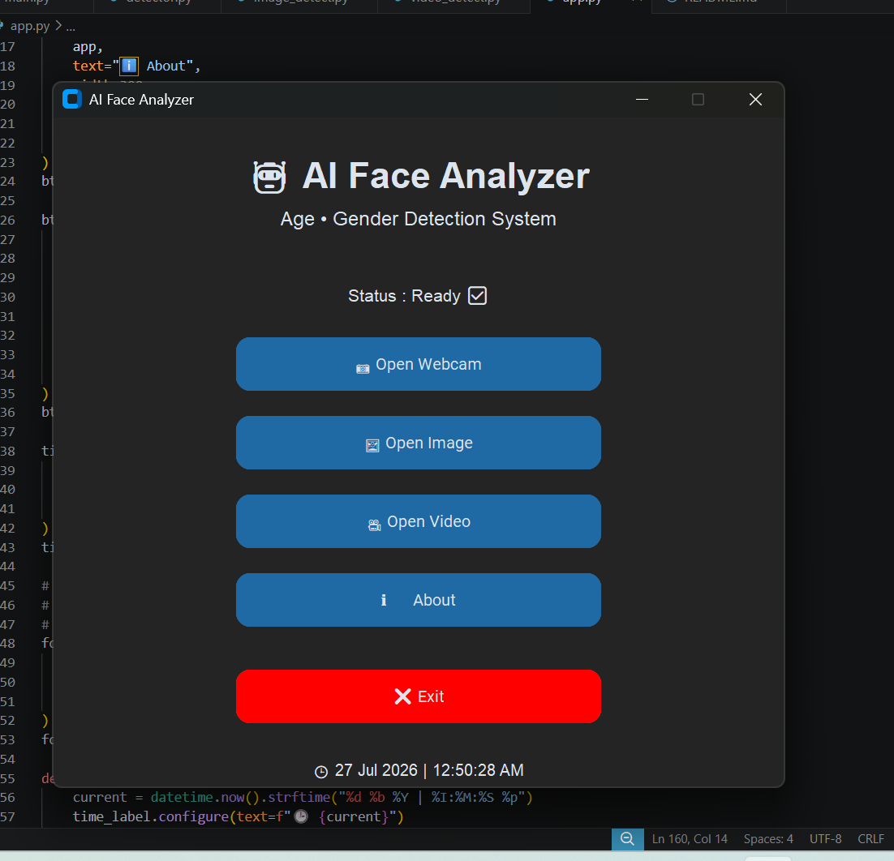

# 🤖 AI Face Analyzer

A modern desktop application built with **Python, OpenCV, InsightFace, and CustomTkinter** that performs **real-time face detection, age prediction, and gender prediction** from a webcam, image, or video.

---

## ✨ Features

- 🎯 Real-Time Face Detection
- 👤 Age Prediction
- 🚻 Gender Prediction
- 📷 Webcam Detection
- 🖼 Image Detection
- 🎥 Video Detection
- 📂 Browse Image & Video
- 🖥 Modern Desktop GUI
- 📅 Live Date & Time
- ℹ️ About Window

---

## 📸 Screenshots

### 🏠 Home Screen



### 📷 Webcam Detection


### 🖼 Image Detection


### 🎥 Video Detection


---

## 🛠 Technologies Used

- Python
- OpenCV
- InsightFace
- ONNX Runtime
- CustomTkinter
- NumPy

---

## 📂 Project Structure

```text
AI-Face-Analyzer/
│
├── app.py
├── detector.py
├── main.py
├── image_detect.py
├── video_detect.py
│
├── models/
│
├── screenshots/
│
├── requirements.txt
└── README.md
```

---

## 🚀 Installation

### 1. Clone Repository

```bash
git clone https://github.com/your-username/AI-Face-Analyzer.git
```

### 2. Open Project

```bash
cd AI-Face-Analyzer
```

### 3. Install Dependencies

```bash
pip install -r requirements.txt
```

### 4. Run Application

```bash
python app.py
```

---

## 💻 Application Modules

### 📷 Webcam Mode

Detects faces in real time using the webcam and predicts:

- Age
- Gender

---

### 🖼 Image Mode

Select any image from your computer and detect:

- Face
- Age
- Gender

---

### 🎥 Video Mode

Select any video file and perform frame-by-frame detection.

---

## 📋 Requirements

- Python 3.12+
- Webcam (for real-time detection)
- Windows 10/11

---

## 🔮 Future Improvements

- Emotion Detection
- Face Recognition
- Face Tracking
- Save Detection Results
- Export CSV Report
- Dark / Light Theme
- Custom Application Icon

---

## 👨‍💻 Developer

**Subham Moharana**

---

## ⭐ Support

If you like this project, consider giving it a ⭐ on GitHub.